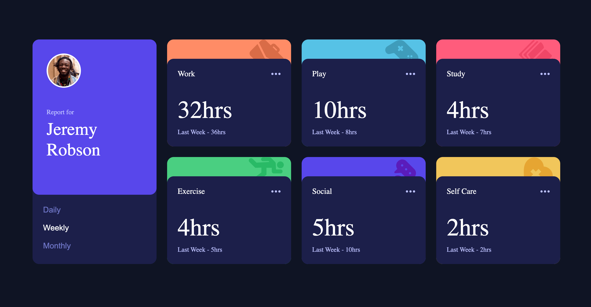

# Time tracking dashboard solution

This is a solution to the [Time tracking dashboard challenge on Frontend Mentor](https://www.frontendmentor.io/challenges/time-tracking-dashboard-UIQ7167Jw). Frontend Mentor challenges help you improve your coding skills by building realistic projects.

## Table of contents

-   [Time tracking dashboard solution](#time-tracking-dashboard-solution)
    -   [Table of contents](#table-of-contents)
    -   [Overview](#overview)
        -   [The challenge](#the-challenge)
        -   [Screenshot](#screenshot)
        -   [Links](#links)
    -   [My process](#my-process)
        -   [Built with](#built-with)
        -   [What I learned](#what-i-learned)
        -   [Continued development](#continued-development)
        -   [Useful resources](#useful-resources)
    -   [Author](#author)
    -   [Acknowledgments](#acknowledgments)

## Overview

### The challenge

Users should be able to:

-   View the optimal layout for the site depending on their device's screen size
-   See hover states for all interactive elements on the page
-   Switch between viewing Daily, Weekly, and Monthly stats

### Screenshot

### Links

-   Solution URL: [https://github.com/EmLopezDev/Time-Tracking-Dashboard](https://github.com/EmLopezDev/Time-Tracking-Dashboard)
-   Live Site URL: [https://emlopezdev.github.io/Time-Tracking-Dashboard/](https://emlopezdev.github.io/Time-Tracking-Dashboard/)

## My process

### Built with

-   Semantic HTML5 markup
-   SCSS custom properties, functions and mixins
-   Flexbox
-   CSS Grid
-   Mobile-first workflow
-   Vanilla JavaScript

### What I learned

-   Re-learned event delegation
-   Re-learned the `.reduce` method
-   Got a better understanding of Promises
-   How to create a neat loading skeleton

### Continued development

-   I would like to continue taking on more challenging JS problems. I know this is where I will do most of my learning and want to develop this skill as much as possible.
-   I would like to work more with fetching data.

### Useful resources

-   [Favorite Resource](https://developer.mozilla.org/en-US/) - This is my favorite resource for just about anything, this helped me with touching up on `event delegation` and the `.reduce()` method.

## Author

-   Frontend Mentor - [@EmLopezDev](https://www.frontendmentor.io/profile/EmLopezDev)

## Acknowledgments

Shout outs to @Darkstar and @chawie on discord for helping me troubleshoot a fetching issue I was having.
